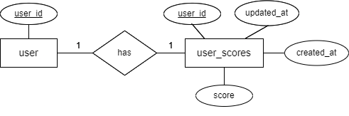

<!-- PROJECT LOGO -->
<br />
<div align="center">
  <h1 align="center">Scoreboard API Module Specification</h3>
</div>

<!-- ABOUT THE PROJECT -->
## About The Module
This document specifies the requirements for a backend API module responsible for managing the top 10 user's scores and updating the scoreboard in real-time. This module will be integrated into the 
existing website to provide a dynamic and secure scorekeeping system.

## Module Requirement
### Functional requirement:
- Save the scores of all users
- Provides a live-updating leaderboard displaying the top 10 users and their scores.
- Updates user scores when receiving authorized API calls from the website.
- Implements security measures to prevent unauthorized score manipulation.
### Non-functional requirement:
- Performance:
  - The module must load the list of the top 10 users and their scores in 2 seconds or less.
  - Update the score for the user in real-time
- Security:
  - The module needs to secure the updation score api

 ## Technology Stack
 Depending on the total number of users we can choose between using web socket or Kafka to achieve real-time updating for the scoreboard. Here I recommend using a web socket for three main reasons:
 - WebSockets are easier to implement and require less infrastructure than Kafka.
 - The number of users is limited so Kafka may be an overkill for this module.
 - WebSockets deliver updates only to connected clients interested in the scoreboard. With Kafka, messages might be sent to a broader audience depending on the topic configuration, potentially creating unnecessary processing.
 ### Websocket
- Websockets provide a direct, two-way communication channel between the web browser and the server.
- When a user's score changes, the server can push the updated scoreboard to all connected clients in real time using web sockets.

## Requirements:
Here we need to save scores for all the users and also a separate table for saving the top 10 users for the scoreboard for faster query the first time get the scoreboard.
### Database design
#### 1. User Scores Table:
- This table stores individual user scores and related data.
- Columns include:
  - user_id (unique identifier for the user)
  - score (current score of the user)
  - last_updated (timestamp of the last score update)
  - created_at (timestamp of the score create)

#### 2. Top Scores Table:
- This table stores only the top 10 user scores and their corresponding user IDs.
- Columns include:
  - rank (position in the leaderboard)
  - user_id (foreign key referencing the User Scores table)
  - score (current score of the user at this rank)

<br />
<div align="center">
  
  <p>Diagram 1. Illustration database ERD</p>
</div>

### Authentication:
- All API requests require user authentication using a JSON Web Token (JWT) in the authorization header. The token must be valid and have the necessary permissions to access the requested endpoint.
- We need to implement the authorization checks on the server-side to ensure only authorized users can update scores. By parsing the JWT token, we can get the user_id and check if the user have enough right
to update the score as well as the user score record exist or not. If sccore record not exist, we can create new record for the user
- Here, I recommend to create an middleware on the gateway to parse the JWT token in the headers first, after that we can forward the request to the service with the user info for checking the right as well as
protect the server.
### Error Codes:
The following error codes might be returned in the response body:

- 400 Bad Request: Invalid request body format or missing required parameters.
- 401 Unauthorized: Invalid or missing authorization token.
- 403 Forbidden: User does not have permission to access the requested resource.
- 404 Not Found: Resource not found (e.g., user with the provided ID doesn't exist).
- 500 Internal Server Error: Unexpected server error occurred.

### API Endpoints:
#### 1. GET /api/v1/scores/leaderboard
- Description: Retrieves the top 10 user scores and their corresponding user IDs.
- Success Response:
   ```
  {
    "data": [
      {
        "rank": 1,
        "user_id": 11,
        "score": 900
      },
      {
        "rank": 2,
        "user_id": 13,
        "score": 856
      },
      // ... (other top 10 entries)
    ]
  }
   ```
- Error Response: Refer to the error codes section above.

#### 2. POST /api/v1/scores/update
- Description: Updates a user's score upon completion of an action.
- Request Body:
  ```
  {
    "user_id": (integer),  // Unique identifier of the user
    "score_delta": (integer),  // Amount to increase the user's score
  }
   ```
- Success Response:
   ```
  {
    "message": "Score updated successfully"
  }
   ```
- Error Response: Refer to the error codes section above.

### Implement for API /api/v1/scores/update endpoint:
In this API, we need to do two job:
- Update score as well as scoreboard in the database
- Broadcast to all the user in case there is any change in the scoreboard list

#### 1. Update score as well as scoreboard in the database:
Here, we don't necessarily need to update both tables every single time a user score is updated. Instead, there are two solution to udpate scoreboard table
- Updating User Score:
- Updating Top Scores:

  

